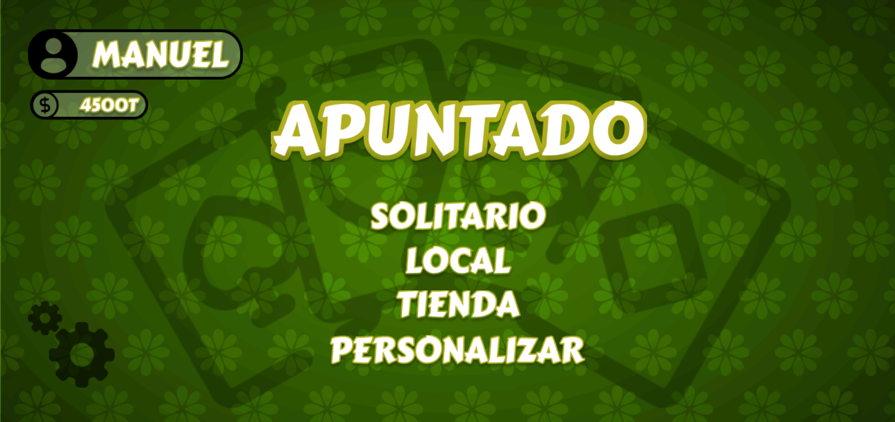

# Maquetación web de apuntado

La idea de este proyecto es practicar el uso de Tailwind CSS y JavaScript para crear una maquetación web de un juego de cartas llamado "Apuntado". El proyecto es una parte de la entrega final de la materia desarrollo de software, en la cual se solicito un prototipo de un juego de cartas.

## Vista previa



## Comenzando 

1. Clona este repositorio en tu máquina local o descargar la carpeta comprimida del proyecto:

   ```bash
   git clone https://github.com/drifterDev/apuntado.git
   ```

## Instalación

1. Instala las dependencias del proyecto con el siguiente comando:

   ```bash
   npm install
   ```

2. Luego, compila los archivos CSS con el siguiente comando:

   ```bash
   npm run build
   ```

3. Abre el archivo `index.html` en tu navegador.

4. Si tienes problemas con el cargado de los archivos CSS o con la funcionalidad del juego, prueba instalando la extensión [Live Server](https://marketplace.visualstudio.com/items?itemName=ritwickdey.LiveServer) en Visual Studio Code y ejecuta el archivo `index.html` con Live Server.

### Prerrequisitos 

Antes de comenzar, asegúrate de tener instalado `npm` en tu sistema. Si no lo tienes instalado, puedes descargarlo e instalarlo desde [el sitio web oficial de Node.js](https://nodejs.org/).

## Construido con 

* [Tailwind CSS](https://tailwindcss.com/) - Framework CSS
* [JavaScript](https://developer.mozilla.org/es/docs/Web/JavaScript) - Lenguaje de programación usado

## Contribuyendo 

Aprecio cualquier sugerencia para mejorar el contenido de este proyecto. Si deseas contribuir, por favor crea un "issue" en el repositorio o contáctame directamente. Valoraré tus aportes para mejorar este repositorio.

## Autores

La maquetación solo es una parte de la entrega final de todo un proyecto. Aunque no participaron en la maquetación del prototipo, el proyecto ha sido construido junto con mis compañeros de equipo:

* **Efrain Gomez Ramirez** [EfraGR](https://github.com/EfraGR)
* **Libardo Jose Navarro Pedrozo** [LibardoNavarro](https://github.com/LibardoNavarro)
* **Sebastián Ocampo Galvis** [SebOcG39](https://github.com/SebOcG39)

## Licencia 

Los códigos incluidos en este proyecto están bajo la Licencia MIT. Para obtener más información, consulta el archivo [LICENSE](LICENSE) en la raíz del repositorio.
